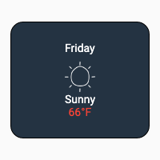
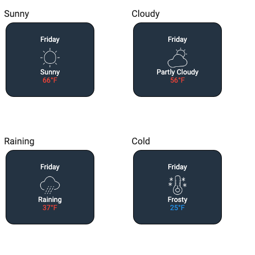
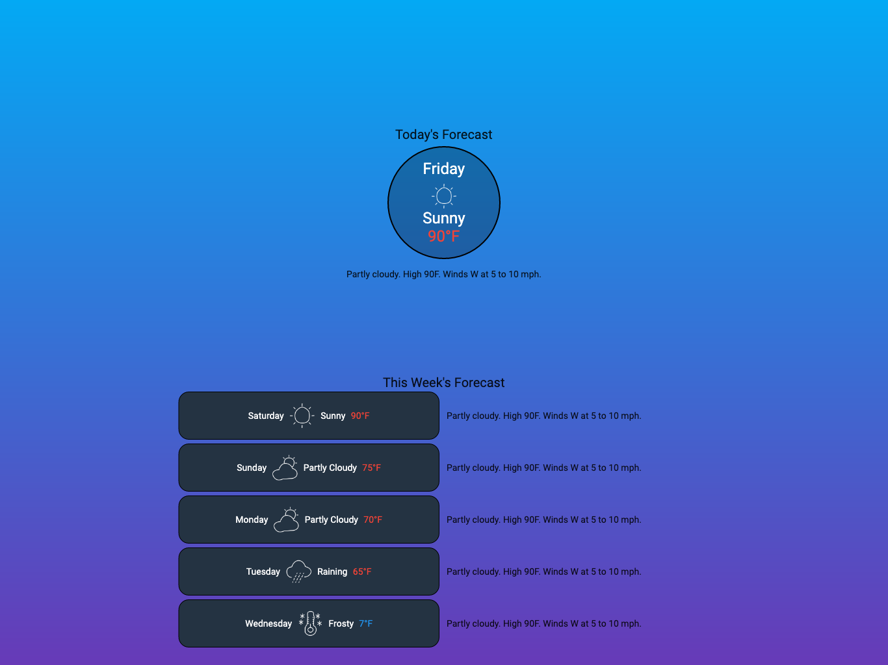
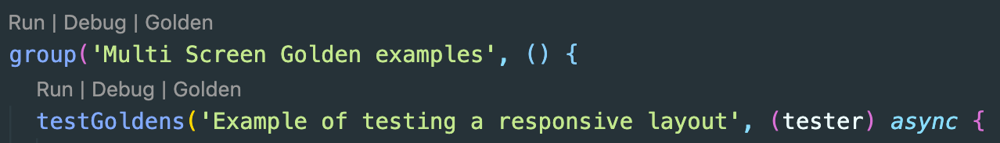
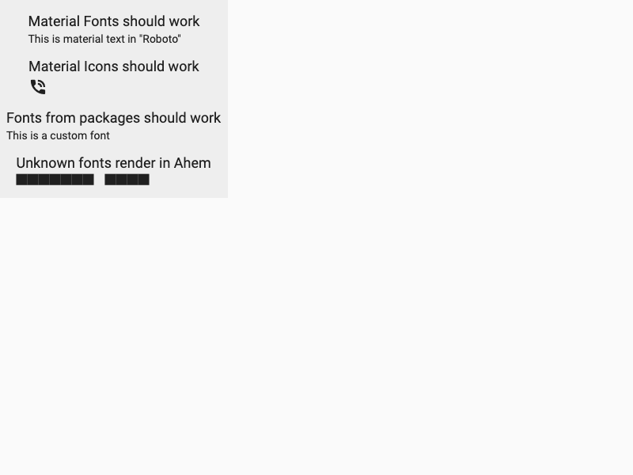

# Golden Toolkit

[](https://travis-ci.org/eBay/flutter_glove_box)[](https://codecov.io/gh/eBay/flutter_glove_box)

This project contains APIs and utilities that build upon [Flutter's Golden test](https://github.com/flutter/flutter/wiki/Writing-a-golden-file-test-for-package:flutter) functionality to provide powerful UI regression tests.

It is highly recommended to look at sample tests here: [golden_builder_test.dart](test/golden_builder_test.dart)

## Table of Contents

- [Key Features](#Key-Features)
  - [GoldenBuilder](#goldenbuilder)
  - [multiScreenGolden](#multiscreengolden)
- [Getting Started](#Getting-Started)
  - [Setup](#Setup)
  - [Loading Fonts](#Loading-Fonts)
  - [testGoldens()](#testGoldens)
  - [Pumping Widgets](#Pumping-Widgets)
  - [Configuration](#Configuration)

## Key Features

### GoldenBuilder

The GoldenBuilder class lets you quickly test various states of your widgets given different sizes, input values or accessibility options. A single test allows for all variations of your widget to be captured in a single Golden image that easily documents the behavior and prevents regression.

Consider the following WeatherCard widget:



You might want to validate that the widget looks correct for different weather types:

```dart
testGoldens('Weather types should look correct', (tester) {
  final builder = GoldenBuilder.grid(columns:2)
          ..addScenario('Sunny', WeatherCard(Weather.sunny))
          ..addScenario('Cloudy', WeatherCard(Weather.cloudy))
          ..addScenario('Raining', WeatherCard(Weather.rain))
          ..addScenario('Cold', WeatherCard(Weather.cold));
  await tester.pumpWidgetBuilder(builder.build());
  await screenMatchesGolden(tester, 'weather_types_grid');
});
```

The output of this test will generate a golden: `weather_types_grid.png` that represents all four states in a single test asset.



A different use case may be validating how the widget looks with a variety of text sizes based on the user's device settings.

```dart
testGoldens('Weather Card - Accessibility', (tester) {
  final widget = WeatherCard(Weather.cloudy);
  final builder = GoldenBuilder.column()
          ..addScenario('Default font size', widget)
          ..addTextScaleScenario('Large font size', widget, textScaleFactor: 2.0)
          ..addTextScaleScenario('Largest font', widget, textScaleFactor: 3.2);
  await tester.pumpWidgetBuilder(builder.build());
  await screenMatchesGolden(tester, 'weather_accessibility');
});
```

The output of this test will be this golden file: `weather_accessibility.png`:


See tests for usage examples: [golden_builder_test.dart](example/test/golden_builder_test.dart)

### multiScreenGolden

The multiScreenGolden assertion is used to capture multiple goldens of a single widget using different simulated device sizes & characteristics.

The typical use case is to validate that a UI is responsive for both phone & tablet.

```dart
testGoldens('Example of testing a responsive layout', (tester) async {
  await tester.pumpWidgetBuilder(WeatherForecast());
  await multiScreenGolden(tester, 'weather_forecast');
});
```

This will generate the following two goldens:

`weather_forecast.phone.png`


`weather_forecast.tablet_landscape.png`



You can also specify the exact device configurations you are interested in:

```dart
await multiScreenGolden(
        tester,
        'weather_forecast',
        devices: [
          const Device(
            name: 'strange_device',
            size: Size(100, 600),
          ),
          const Device(
            name: 'accessibility',
            size: Size(375, 667),
            textScale: 2.5,
          )
        ],
      );
```

## Getting Started

_A Note on Golden Testing:_

Goldens aren't intended to be a replacement of typical behavioral widget testing that you should perform. What they provide is an automated way to provide regression testing for all of the visual details that can't be validated without manual verification.

The Golden assertions take longer to execute than traditional widget tests, so it is recommended to be intentional about when they are used. Additionally, they can have many reasons to change. Often, the primary reason a golden test will fail is becaue of an intentional change. Thankfully, Flutter makes it easy to regenerate new reference images.

The rule of thumb that the eBay Motors team has used is to minimize our "full-screen" goldens and reserve them for high-level visual integration tests. Often, we only have one `multiScreenGolden()` test per screen.

For testing variations, edge cases, permutations, etc, we tend to use the `GoldenBuilder` focused on smaller widgets that have fewer reasons to change.

### Setup

If you are new to Flutter's Golden testing, there are a few things you might want to do

#### Add the failures folder to .gitignore

When golden tests fail, artifacts are generated in a `failures` folder adjacent to your test. These are not intended to be tracked in source control.

```.gitignore
# don't check in golden failure output
**/failures/*.png
```

#### Configure VS Code

If you use VSCode, we highly recommend adding this configuration to your `.vscode/launch.json` file in the root of your workspace.

```json
{
  // Use IntelliSense to learn about possible attributes.
  // Hover to view descriptions of existing attributes.
  // For more information, visit: https://go.microsoft.com/fwlink/?linkid=830387
  "version": "0.2.0",
  "configurations": [
    {
      "name": "Golden",
      "request": "launch",
      "type": "dart",
      "template": "run-test",
      "args": ["--update-goldens"]
    }
  ]
}
```

This give you a context menu where you can easily regenerate a golden for a particular test directly from the IDE:



### Loading Fonts

By default, flutter test only uses a single "test" font called Ahem.
This font is designed to show black spaces for every character and icon. This obviously makes goldens much less valuable if you are trying to verify that your app looks correct.

To make the goldens more useful, we have a utility to dynamically inject additional fonts into the flutter test engine so that we can get more human viewable output.

In order to inject your fonts, we have a helper method:

```dart
  await loadAppFonts();
```

This function will automatically load the `Roboto` font, and any fonts included from packages you depend on so that they are properly rendered during the test.

Material icons like `Icons.battery` will be rendered in goldens ONLY if your pubspec.yaml includes:

```yaml
flutter:
  uses-material-design: true
```

Note, if you need Cupertino fonts, you will need to find a copy of `.SF UI Display Text.ttf`, and `.SF UI Text.ttf` to include in your package's yaml. These are not included in this package by default for licensing reasons.

The easiest and recommended way to invoke this, is to create a `flutter_test_config.dart` file in the root of your package's test directory with the following content:

```dart
import 'dart:async';

import 'package:golden_toolkit/golden_toolkit.dart';

Future<void> main(FutureOr<void> testMain()) async {
  await loadAppFonts();
  return testMain();
}
```

For more information on `flutter_test_config.dart`, see the [Flutter Docs](https://api.flutter.dev/flutter/flutter_test/flutter_test-library.html)

#### Caveats

Unfortunately, Flutter's font loading support for testing is fairly limited.

At the moment, it is only possible to load a single .ttf file for a font family. This means it may not be possible to get the proper visuals to appear. For example, different font weights may not work:



Additionally, in some instances, it is not possible to replace the "Ahem" font. There are specific places in the Flutter codebase, such as rendering the "debug banner" where no explicit font family is specified. In these instances, the engine will use Ahem in a test context, with no way to override the behavior.

### testGoldens()

It is possible to use golden assertions in any testWidgets() test. As the UI for a widget evolves, it is common to need to regenerate goldens to capture your new reference images. The easiest way to do this is via the command-line:

```sh
flutter test --update-goldens
```

By default, this will execute all tests in the package. In a package with a large number of non-golden widget tests, we found this to be sub-optimal. We would much rather run ONLY the golden tests when regenerating. Initially, we arrived at a convention of ensuring that the test descriptions included the word 'Golden'

```sh
flutter test --update-goldens --name=Golden
```

However, there wasn't a way to enforce that developers named their tests appropriately, and this was error-prone.

Ultimately, we ended up making this `testGoldens()` function to enforce the convention. It has the same signature as `testWidgets` but it will automatically structure the tests so that the above flutter test command can work.

Additionally, the following test assertions will fail if not executed within testGoldens:

```dart
multiScreenGolden()
screenMatchesGolden()
```

### Pumping Widgets

Flutter Test's `WidgetTester` already provides the ability to pump a widget for testing purposes.

However, in many cases it is common for the Widget under test to have a number of assumptions & dependencies about the widget tree it is included in. For example, it might require Material theming, or a particular Inherited Widget. Often this setup is common and shared across multiple widget tests.

For convenience, we've created an extension for [WidgetTester] with a function `pumpWidgetBuilder` to allow for easy configuration of the parent widget tree & device configuration to emulate.

`pumpWidgetBuilder` has optional parameters `wrapper`, `surfaceSize`, `textScaleSize`

This is entirely optional, but can help reduce boilerplate code duplication.

Example:

```dart
 await tester.pumpWidgetBuilder(yourWidget, surfaceSize: const Size(200, 200));
```

`wrapper` parameter is defaulted to `materialAppWrapper`, but you can use your own custom wrappers.

**Important**: `materialAppWrapper` allows your to inject specific platform, localizations, locales, theme and etc.

Example of injecting light Theme:

```dart
      await tester.pumpWidgetBuilder(
        yourWidget,
        wrapper: materialAppWrapper(
          theme: ThemeData.light(),
          platform: TargetPlatform.android,
        ),
      );
```

Note: you can create your own wrappers similar to `materialAppWrapper`

See more usage examples here: [golden_builder_test.dart](test/golden_builder_test.dart)

### Configuration

There are global settigns that can be configured by calling the following API:

```GoldenToolkit.configure()```

Currently, the primary option is to allow consumers to holistically skip golden assertions. For example, perhaps you only want to perform golden assertions on certain platforms.

See here as an example: [flutter_test_config.dart](test/flutter_test_config.dart)

## License Information

Copyright 2019-2020 eBay Inc.

Redistribution and use in source and binary forms, with or without
modification, are permitted provided that the following conditions are
met:

- Redistributions of source code must retain the above copyright
  notice, this list of conditions and the following disclaimer.
- Redistributions in binary form must reproduce the above
  copyright notice, this list of conditions and the following disclaimer
  in the documentation and/or other materials provided with the
  distribution.
- Neither the name of eBay Inc. nor the names of its
  contributors may be used to endorse or promote products derived from
  this software without specific prior written permission.

THIS SOFTWARE IS PROVIDED BY THE COPYRIGHT HOLDERS AND CONTRIBUTORS
"AS IS" AND ANY EXPRESS OR IMPLIED WARRANTIES, INCLUDING, BUT NOT
LIMITED TO, THE IMPLIED WARRANTIES OF MERCHANTABILITY AND FITNESS FOR
A PARTICULAR PURPOSE ARE DISCLAIMED. IN NO EVENT SHALL THE COPYRIGHT
OWNER OR CONTRIBUTORS BE LIABLE FOR ANY DIRECT, INDIRECT, INCIDENTAL,
SPECIAL, EXEMPLARY, OR CONSEQUENTIAL DAMAGES (INCLUDING, BUT NOT
LIMITED TO, PROCUREMENT OF SUBSTITUTE GOODS OR SERVICES; LOSS OF USE,
DATA, OR PROFITS; OR BUSINESS INTERRUPTION) HOWEVER CAUSED AND ON ANY
THEORY OF LIABILITY, WHETHER IN CONTRACT, STRICT LIABILITY, OR TORT
(INCLUDING NEGLIGENCE OR OTHERWISE) ARISING IN ANY WAY OUT OF THE USE
OF THIS SOFTWARE, EVEN IF ADVISED OF THE POSSIBILITY OF SUCH DAMAGE.

## 3rd Party Software Included or Modified in Project

This software contains some 3rd party software licensed under open source license terms:

1. Roboto Font File:
   Available at URL: [https://github.com/google/fonts/tree/master/apache/roboto](https://github.com/google/fonts/tree/master/apache/roboto)
   License: Available under Apache license at [https://github.com/google/fonts/blob/master/apache/roboto/LICENSE.txt](https://github.com/google/fonts/blob/master/apache/roboto/LICENSE.txt)

2. Icons at:
   Author: Adnen Kadri
   URL: [https://www.iconfinder.com/iconsets/weather-281](https://www.iconfinder.com/iconsets/weather-281)
   License: Free for commercial use

3. OpenSans Font File:
   Available at URL: [https://github.com/googlefonts/opensans](https://github.com/googlefonts/opensans)
   License: Available under Apache license at [https://github.com/googlefonts/opensans/blob/master/LICENSE.txt](https://github.com/googlefonts/opensans/blob/master/LICENSE.txt)
