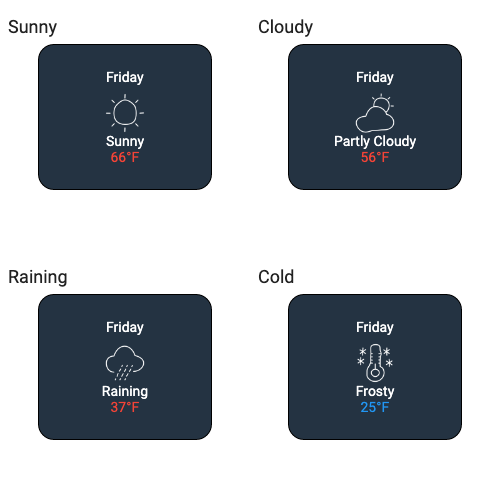
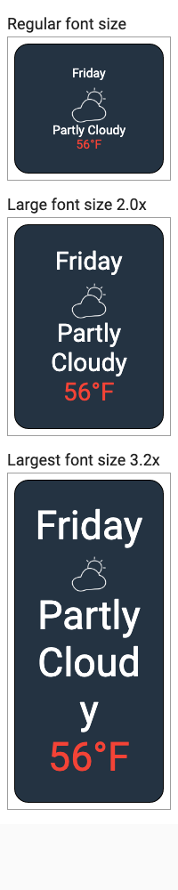

# Flutter Glove Box

Flutter testing tools

This project contains various testing tools that eBay Motors App team is using in their development on daily basis.

It is highly recommended to look at sample tests here: [golden_builder_test.dart](test/golden_builder_test.dart)

### Pumping widgets

Contains an extension for [WidgetTester] with single convenience function `pumpWidgetBuilder` to pump your widget during the test.

`pumpWidgetBuilder` has optional parameters `wrapper`, `surfaceSize`, `textScaleSize`

Example: 
```dart
 await tester.pumpWidgetBuilder(yourWidget, surfaceSize: const Size(200, 200));
```

 `wrapper` parameter is defaulted to  `materialAppWrapper`, but you can use your own custom wrappers.
 
**Important**:  `materialAppWrapper` allows your to inject specific platform, localizations, locales, theme and etc.

Example of injecting light Theme:

```dart
      await tester.pumpWidgetBuilder(
        yourWidget,
        wrapper: materialAppWrapper(
          theme: ThemeData.light(),
          platform: TargetPlatform.android,
        ),
      );
```
Note: you can create your own wrappers similar to `materialAppWrapper`


See more usage examples here: [golden_builder_test.dart](test/golden_builder_test.dart)

### GoldenBuilder

The GoldenBuilder tool lets you  quickly test various states of your widgets given different screen sizes, input values or accessibility options.


##### Supported features:
- GoldenBuilder.column() - layouts your goldens in a column
- GoldenBuilder.grid() - layouts your goldens as a grid
- multiScreenGolden() - shows how your screen/widget will look on different screen sizes


If you want to make sure that above WeatherCard looks properly given different input values, do:


```dart
final builder = GoldenBuilder.grid(columns:2)
        ..addTest('Sunny', WeatherCard(Weather.sunny))
        ..addTest('Cloudy', WeatherCard(Weather.cloudy))
        ..addTest('Raining', WeatherCard(Weather.rain))
        ..addTest('Cold', WeatherCard(Weather.cold));
        
await tester.pumpWidgetBuilder(builder.build());
await screenMatchesGolden(tester, 'weather_types');
```

The output of this test will be this golden file:



In order to test with different font sizes, do:
```dart

        ..addTest('Regular font size', widget)
        ..addTestWithLargeText('Large font size', widget, maxTextSize: 2.0)
        ..addTestWithLargeText('Largest font', widget, maxTextSize: 3.2);
```
The output of this test will be this golden file:



See tests for usage examples: [golden_builder_test.dart](test/golden_builder_test.dart)


### Font Loader
By default, flutter test only uses a single "test" font called Ahem. 
This font is designed to show black spaces for every character and icon. This obviously makes goldens much less valuable.

To make the goldens more useful, we have a utility to dynamically inject additional fonts into the flutter test engine so that we can get more human viewable output.
In order to inject your fonts, just call font loader function on top of your test file:
```dart
  await loadAppFonts(from: 'yourFontDirectoryPath');
```

Function will load all the fonts from that directory using FontLoader so they are properly rendered during the test.
Material icons like `Icons.battery`  will be rendered in goldens ONLY if your pre-load MaterialIcons-Regular.ttf font that contains all the icons.


## License Information
Copyright 2019-2020 eBay Inc.

Redistribution and use in source and binary forms, with or without
modification, are permitted provided that the following conditions are
met:

   * Redistributions of source code must retain the above copyright
notice, this list of conditions and the following disclaimer.
   * Redistributions in binary form must reproduce the above
copyright notice, this list of conditions and the following disclaimer
in the documentation and/or other materials provided with the
distribution.
   * Neither the name of eBay Inc. nor the names of its
contributors may be used to endorse or promote products derived from
this software without specific prior written permission.

THIS SOFTWARE IS PROVIDED BY THE COPYRIGHT HOLDERS AND CONTRIBUTORS
"AS IS" AND ANY EXPRESS OR IMPLIED WARRANTIES, INCLUDING, BUT NOT
LIMITED TO, THE IMPLIED WARRANTIES OF MERCHANTABILITY AND FITNESS FOR
A PARTICULAR PURPOSE ARE DISCLAIMED. IN NO EVENT SHALL THE COPYRIGHT
OWNER OR CONTRIBUTORS BE LIABLE FOR ANY DIRECT, INDIRECT, INCIDENTAL,
SPECIAL, EXEMPLARY, OR CONSEQUENTIAL DAMAGES (INCLUDING, BUT NOT
LIMITED TO, PROCUREMENT OF SUBSTITUTE GOODS OR SERVICES; LOSS OF USE,
DATA, OR PROFITS; OR BUSINESS INTERRUPTION) HOWEVER CAUSED AND ON ANY
THEORY OF LIABILITY, WHETHER IN CONTRACT, STRICT LIABILITY, OR TORT
(INCLUDING NEGLIGENCE OR OTHERWISE) ARISING IN ANY WAY OUT OF THE USE
OF THIS SOFTWARE, EVEN IF ADVISED OF THE POSSIBILITY OF SUCH DAMAGE.

## 3rd Party Software Included or Modified in Project
This software contains some 3rd party software licensed under open source license terms:

1. Roboto Font File:
Available at URL: https://github.com/google/fonts/tree/master/apache/roboto <BR>
License: Available under Apache license at https://github.com/google/fonts/blob/master/apache/roboto/LICENSE.txt

2. Material Icon File:
URL: https://github.com/google/material-design-icons <BR>
License: Available under Apache license at https://github.com/google/material-design-icons/blob/master/LICENSE
 
3. Icons at:
Author: Adnen Kadri
URL: https://www.iconfinder.com/iconsets/weather-281
License: Free for commercial use
